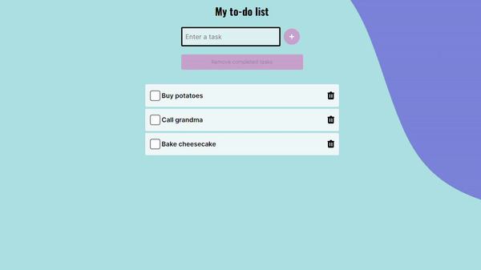

# To do list (Vue) [School Project]

To do list is a classic task listing application. You can add and remove tasks.

- It will neither send data to the server nor hold data locally.
- I have [React version](https://github.com/TsubasaFujii/todo-list) in the same design.
- This is built in **Vue**

You can also check [Production Version](https://bright-dasik-b436d3.netlify.app/)
